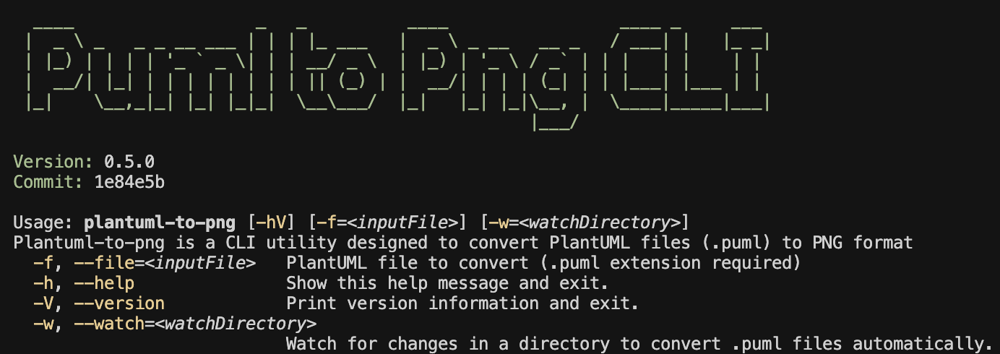

# Plantuml to PNG CLI

[](https://github.com/jabrena/plantuml-to-png-cli/actions/workflows/maven.yaml)

[](https://sonarcloud.io/summary/new_code?id=jabrena_plantuml-to-png-mcp)

## Motivation

Plantuml-to-png is a CLI utility designed to convert PlantUML files (.puml) to PNG format

When you store your `.puml` files in your repository, you need to do an extra step in order to generate the image in `.png` format using a Third party service.

Using this project, you could simplify this step.



## How to build in local?

Review the document [README-DEV](./README-DEV.md)

## How to test it?

```bash
./mvnw clean package
java -jar target/puml-to-png-0.5.0.jar --help
java -jar target/puml-to-png-0.5.0.jar --file ./docs/sample-diagram.puml
java -jar target/puml-to-png-0.5.0.jar --watch docs

# Update puml-to-png@jabrena only
jbang --fresh puml-to-png@jabrena
jbang catalog list jabrena

jbang puml-to-png@jabrena --help
jbang puml-to-png@jabrena --file ./docs/sample-diagram.puml
jbang puml-to-png@jabrena --watch docs
```

## References
- https://picocli.info/
- https://mvnrepository.com/artifact/net.sourceforge.plantuml/plantuml/1.2023.10
- https://graphviz.org/
- https://github.com/plantuml/plantuml
- https://plantuml.com/es/smetana02
- https://www.jbang.dev/appstore/

## Cursor rules ecosystem

- https://github.com/jabrena/101-cursor
- https://github.com/jabrena/cursor-rules-methodology
- https://github.com/jabrena/cursor-rules-agile
- https://github.com/jabrena/cursor-rules-java
- https://github.com/jabrena/cursor-rules-spring-boot
- https://github.com/jabrena/cursor-rules-examples
- https://github.com/jabrena/cursor-rules-sandbox
- https://github.com/jabrena/plantuml-to-png-cli
- https://github.com/jabrena/setup-cli
- https://github.com/jabrena/jbang-catalog

Powered by [Cursor](https://www.cursor.com/)
