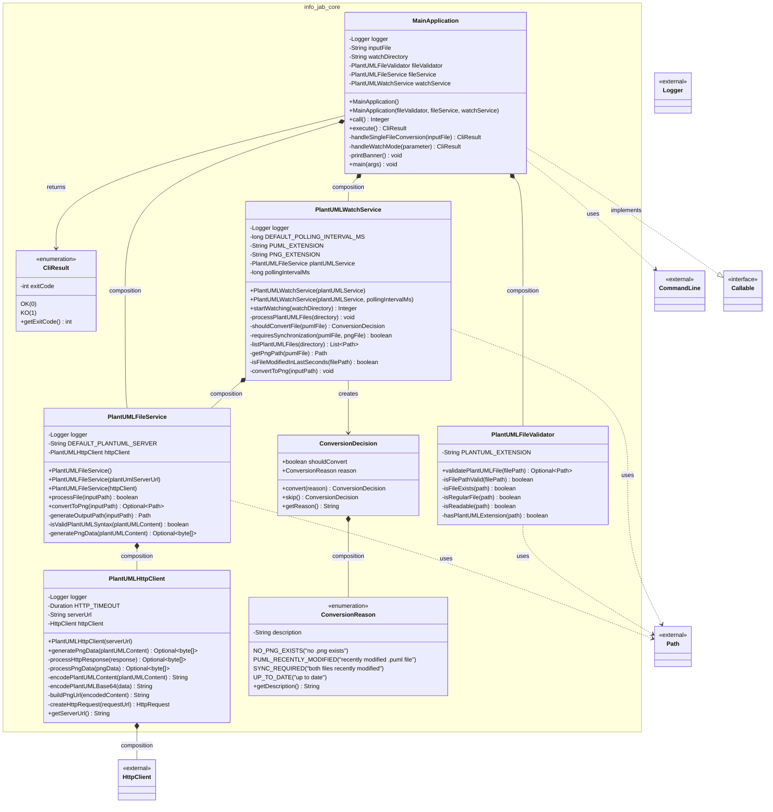

# Core Class Diagram - Mermaid Version

This document contains the Mermaid version of the PlantUML to PNG CLI tool core class diagram.

## Class Diagram

## Architecture Overview

### Core Components

**MainApplication**
- Main entry point for CLI operations
- Implements `Callable` interface for PicoCLI integration
- Coordinates file processing operations
- Handles both single file conversion and watch mode

**PlantUMLFileValidator**
- Validates input files (existence, permissions, .puml extension)
- Returns `Optional<Path>` for validated files

**PlantUMLFileService**
- Core business logic for PlantUML to PNG conversion
- Delegates HTTP operations to `PlantUMLHttpClient`
- Handles file reading, syntax validation, and output generation

**PlantUMLHttpClient**
- Manages HTTP communication with PlantUML server
- Implements custom PlantUML encoding (deflate compression + custom base64)
- Handles HTTP timeout and error scenarios

**PlantUMLWatchService**
- Polling-based file watcher for automatic conversion
- Uses `ConversionDecision` pattern to determine when conversion is needed
- Supports configurable polling intervals

### Supporting Types

**CliResult**
- Enumeration for command execution results (OK=0, KO=1)

**ConversionDecision & ConversionReason**
- Encapsulates logic for determining when files should be converted
- Reasons include: no PNG exists, recently modified PUML, synchronization required, etc.

### External Dependencies

- **PicoCLI**: Command line parsing and execution framework
- **Java HTTP Client**: For HTTP communication with PlantUML server
- **SLF4J**: Logging framework
- **Java NIO**: File system operations

## Usage

This diagram represents the architecture of a CLI tool that:
1. Accepts `.puml` files as input
2. Validates and processes them
3. Sends content to a PlantUML server for PNG generation
4. Saves the resulting PNG files locally
5. Optionally watches directories for automatic conversion
